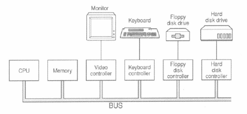
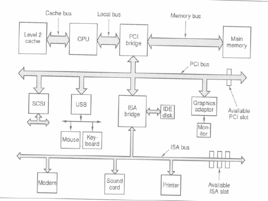
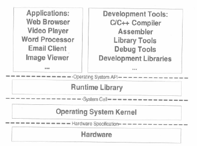

- 早期计算机 CPU 核心频率不高，跟内存的频率一样，它们都直接连接在同一个*总线*（Bus）上。I/O 设备（如显示设备、键盘、磁盘）的速度比 CPU 和内存慢很多，为了协调 I/O 设备与总线之间的速度，也为了让 CPU 能够和 I/O 设备进行通信，一般每个设备都会有一个 *I/O 控制器*。
    
- 后来由于 CPU 的核心频率的提升，内存跟不上 CPU 的速度，产生了与内存频率一致的总线，而 CPU 采用*倍频*的方式与系统总线进行通信。
- 随着图形化操作系统的普及，图形芯片需要跟 CPU 和内存大量交换数据，慢速的 I/O 总线无法满足图形设备的需求，于是设计了高速的*北桥芯片*。
- 若相对低速的设备也连接在北桥，北桥既要处理高速设备又要处理低速设备，设计会十分复杂，于是设计了专门处理低速设备的*南桥芯片*。磁盘、USB、键盘、鼠标等设备都连接在南桥上，由南桥汇总后链接到北桥。
- 20 世纪 90 年代的 PC 机在系统总线上采用 PCI 结构，低速设备上采用 ISA 总线。
    
- PCI 的最高速度为 133MHz，不能满足需求，又设计出 AGP、PCI Express 等总线结构和相应的控制芯片。
- 硬件结构越来越复杂，但还是没脱离最初的 CPU、内存以及 I/O 的基本结构。
- CPU 制造工艺已达物理极限，除非制造工艺有本质突破，否则 CPU 的频率会一直被 4GHz 的天花板限制。
- 另一个提高速度的办法是增加 CPU 数量。最常见的一种形式是*对称多处理器*（SMP, symmetrical multi-processing），每个 CPU 在系统中所处的地位和发挥的功能都一样，但速度不会线性提高。
    - > 10 个女人不能再一个月生出一个孩子。
- 多核处理器最常见的应用场景是大型数据库、网络服务器，它们要同时处理大量的请求，而这些请求之间往往是相对独立的。对于个人电脑而言先得有些奢侈。
- 处理器厂商将多个处理器合并在一起打包出售，被打包的处理器之前共享比较昂贵的**缓存部件**，只保留多个核心，并以一个处理器的外包装进行出售，售价纸币单核处理器贵一点。这就是多核处理器（multi-core processor）的基本想法。
- 多核处理器是 SMP 的简化版，细节上存在差别，站在程序员的角度来看，它们之间的区别很小，逻辑上来看完全相同，只是多核和 SMP 在缓存共享等方面有些微差别，使得程序在优化上可以有针对性地处理。
- Any problem in computer science can be solved by another layer of indirection.
    
- 每个层次间的通信协议称为接口。接口的下面一层是接口的提供者，由它定义接口；接口的上面那层是接口的使用者，它使用接口来实现所需要的功能。层次体系中，接口尽量保持稳定不变，理论上层次之间只要遵循这个接口，任何一个层都可以被修改或替换。除了硬件和应用程序，其它都是中间层，每个中间层都是对它下面一层的包装和扩展。中间层的存在使得应用程序和硬件之间保持相对独立。
    - **虚拟机**技术在硬件和操作系统之间增加了一层虚拟层，使得一个计算机上可以同时运行多个操作系统。
- 从整个层次结构上看，开发工具和应用程序属于同一个层次，它们都使用操作系统的应用程序编程接口（application programming interface）。
- 应用程序接口的提供者是*运行库*，不同的运行库提供不同的 API。
    - Linux 的 `Glibc` 库提供 POSIX 的 API；Windows 的运行库提供 Windows API，常见的 32 位 Windows 提供的 API 又称为 Win32。
- 运行库使用操作系统提供的系统调用接口（system call interface）。系统调用接口再视线中往往以*软件中断*（software interrupt）的方式提供。
    - Linux 使用 `0x80` 号中断作为系统调用接口。
- 硬件厂商负责提供*硬件规格*（hardware specification），操作系统和驱动程序的开发者通过阅读硬件规格文档规定的硬件编程接口标准来编写操作系统和驱动程序。
<!-- continues at p18 -->